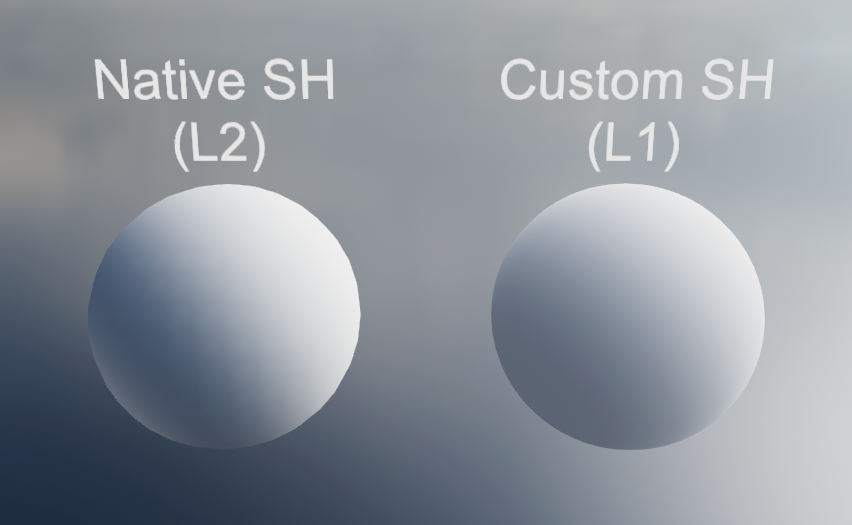

# SphericalHarmonicsDev

# What is this?
A tiny Unity project that uses my [Spherical Harmonics package](https://github.com/Fewes/SphericalHarmonics) to demonstrate how to use it.

The implementation can be found in SHTester.shader. In the vertex shader, it initializes an empty SH structure and adds radiance from the global reflection probe using a fibonacci sphere distribution. It then packs the result in 3 float4 interpolators and passes it to the fragment shader which unpacks it and samples the result based on a spherical normal. The result is compared with Unity's built-in SH lighting.
